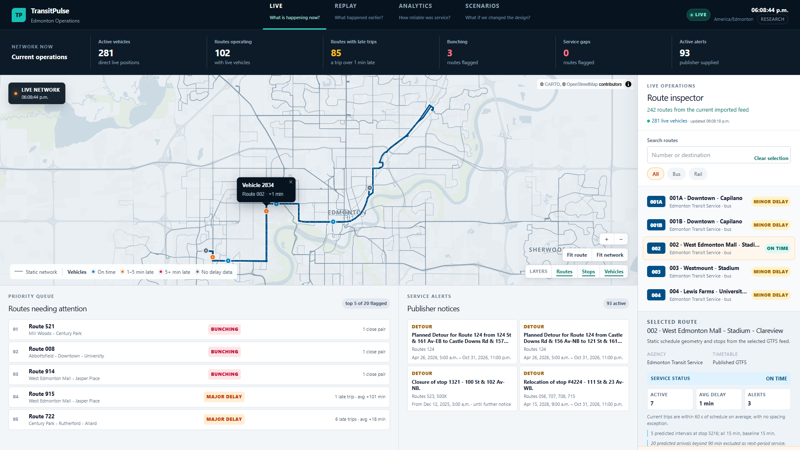
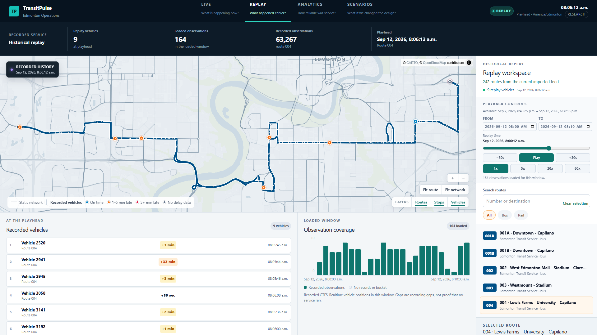
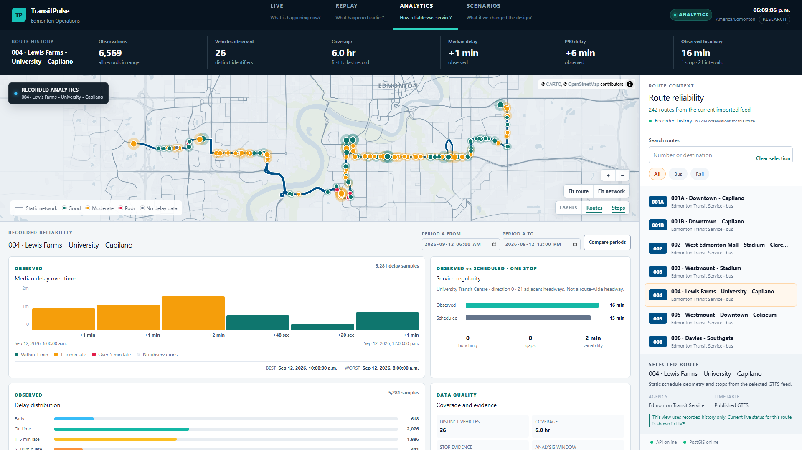
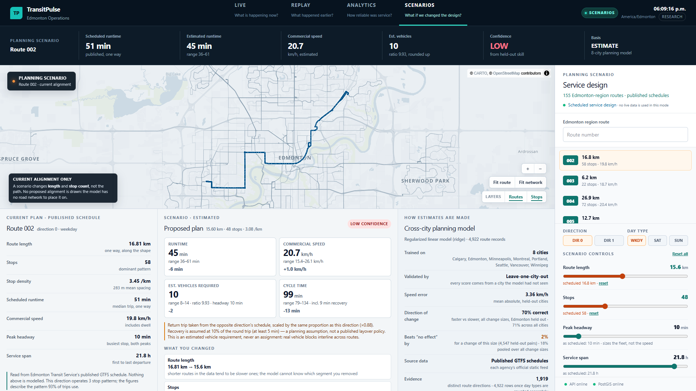
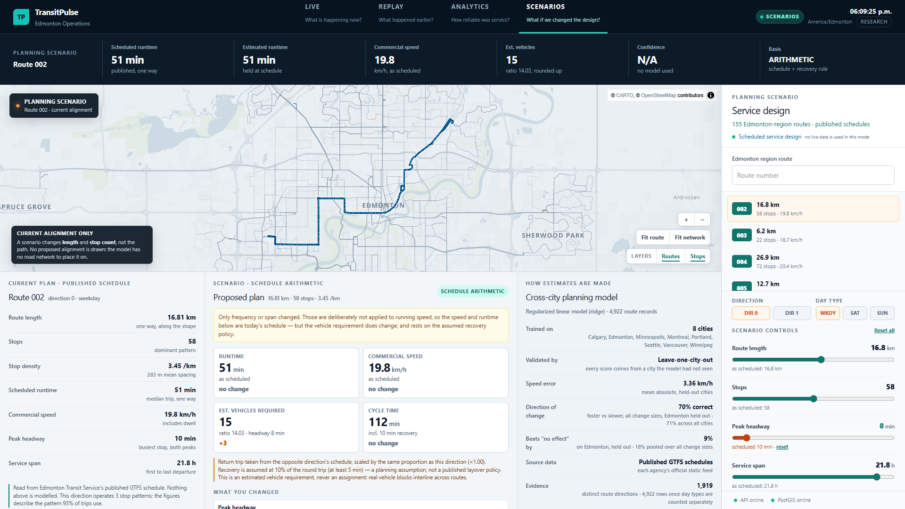
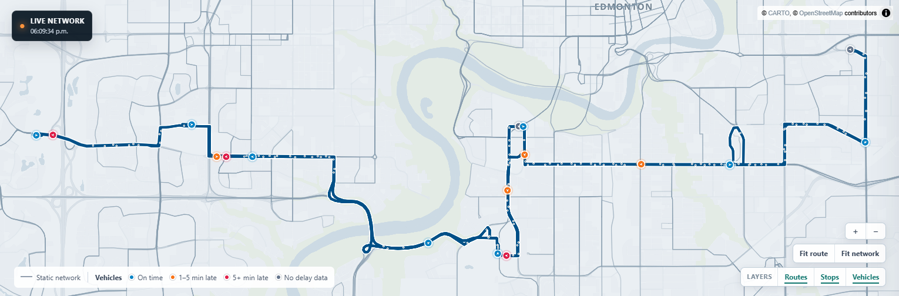
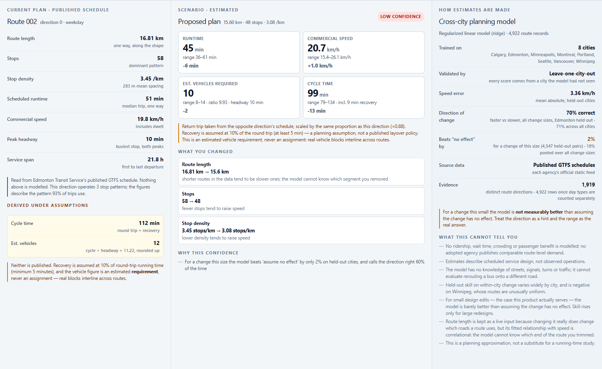
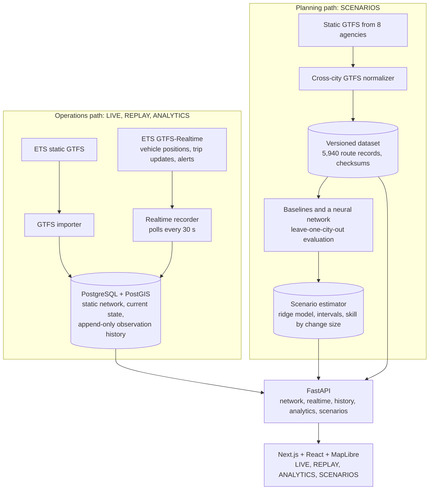

# TransitPulse

Real-time transit analytics for Edmonton, built on the city's official GTFS and
GTFS-Realtime feeds, with an experimental route-planning estimator trained on
timetables from eight North American transit agencies.



**Status:** portfolio project, feature-complete as of September 2026 and in
maintenance mode. It runs locally (Windows launcher). It is not deployed
anywhere. Project page: [`docs/index.html`](docs/index.html) (static, see
[Project page](#project-page)).

## What it is

TransitPulse is a full-stack web application with four modes:

| Mode | Question | What it does |
| --- | --- | --- |
| **LIVE** | What is happening now? | Shows every reporting Edmonton Transit Service (ETS) vehicle coloured by delay, a queue of routes needing attention (bunching, service gaps, average delay of 5+ minutes late or early), publisher alerts and a route inspector. |
| **REPLAY** | What happened earlier? | Plays back recorded vehicle positions from an append-only history, with a coverage chart that shows recording gaps instead of hiding them. |
| **ANALYTICS** | How reliable was service? | Compares observed delay and headways from recorded history against the published timetable for one route, per stop and direction, and compares two time periods. |
| **SCENARIOS** | What might change if the route design changed? | Estimates runtime, commercial speed, cycle time and vehicle requirement for a changed route length, stop count, headway, service span or recovery policy, with a range and a confidence level. **Experimental.** |

## Why I built it

I wanted one project that follows real, messy public data all the way through:
ingesting live feeds reliably, keeping a trustworthy historical record, turning
that record into service analytics, and then asking a planning question that a
model can only partly answer. The planning part is deliberately explicit about
what it does not know.

## What works today, and what is experimental

**Works** (API, tests and build re-checked on 2026-09-13; the full UI was last exercised, and the screenshots captured, on 2026-09-12):

- Static GTFS import of the official ETS feed into PostgreSQL/PostGIS (242 routes, 657 route shapes in the current feed).
- A realtime recorder that polls the three ETS GTFS-Realtime feeds (vehicle positions, trip updates, alerts) every 30 seconds.
- Recorded history: 1,821,960 vehicle observations between 2026-09-07 and 2026-09-13, with gaps wherever the recorder or feed was down.
- LIVE, REPLAY and ANALYTICS over that data, through a FastAPI backend and a Next.js/MapLibre frontend.
- The SCENARIOS API and UI, backed by a locally built model artifact.

**Experimental or incomplete:**

- **SCENARIOS estimates are approximations of scheduled service.** For the small edits a planner usually makes, the model is only 0.5–2.3% better than assuming the change has no effect, and the UI labels those estimates LOW confidence. There is no road network and no ridership data.
- **`/research/model-lab`** shows an earlier single-route travel-time experiment. Its route-simulation validation never ran: 0 of 68 recorded runs covered a route end to end. It is kept for inspection only.
- **`apps/api/transitpulse_ml/service_optimizer.py`** is an experimental service-design search. It is not in the UI because, without demand data, it can recommend cutting service on busy routes.
- **Docker Compose** (`docker-compose.yml`) is an early scaffold. It was not verified end to end; the supported path is the native Windows setup below.

## Screenshots

| | |
| --- | --- |
|  |  |
| **REPLAY:** recorded positions at the playhead, with recording coverage. | **ANALYTICS:** observed delay and headways against the timetable. |
|  |  |
| **SCENARIOS, design change:** 16.8→15.6 km and 58→48 stops. Wide range, LOW confidence. | **SCENARIOS, frequency change:** headway 10→8 min. Speed is held; the vehicle requirement goes from 12 to 15. |
|  |  |
| **Map:** custom MapLibre style, route emphasis and delay-coloured vehicles. | **Current vs estimated:** the published plan, the estimate with ranges, and how the model was validated. |

Both scenarios are documented with exact inputs and outputs in
[`docs/demo_scenarios.md`](docs/demo_scenarios.md).

## Architecture



| Layer | Technology | Where |
| --- | --- | --- |
| Frontend | Next.js 16, React 19, TypeScript, MapLibre GL 6 | `apps/web/app/` |
| Backend | FastAPI, Pydantic, SQLAlchemy 2, GeoAlchemy2 | `apps/api/transitpulse_api/` |
| Database | PostgreSQL + PostGIS, Alembic migrations | `migrations/` |
| Data and modelling | Python standard library GTFS parsing, NumPy, scikit-learn; PyTorch only for a rejected experiment | `apps/api/transitpulse_ml/`, `scripts/` |
| Launcher | Windows batch script | `START_TRANSITPULSE.bat` |

**Backend.** `main.py` exposes typed JSON endpoints: network (`/api/routes`,
`/api/network/shapes`, stops, shapes), realtime (`/api/realtime/*`), operations
(`/api/operations/network`, `/api/operations/routes/{id}`), bounded history
(`/api/history/*`), analytics (`/api/analytics/routes/{id}` and `/compare`) and
scenarios (`/api/scenarios/*`). Next.js rewrites `/api/*` to the API, so the
browser only talks to one origin.

**Database and PostGIS.** Static GTFS tables are scoped to an imported feed
version identified by the archive's SHA-256, so an import never overwrites an
older feed. Stops and vehicle positions are `POINT` geometries and route shapes
are `LINESTRING` geometries (SRID 4326) with GiST indexes; the API returns them
as GeoJSON with `ST_AsGeoJSON`, `ST_X` and `ST_Y`. Current realtime state lives
in separate tables from the recorded history, and migration `0007` adds
triggers that reject `UPDATE` and `DELETE` on the two history tables.

**GTFS and GTFS-Realtime.** The importer checks required files, columns,
references and GTFS `location_type` rules before writing anything, then inserts
every table in one transaction, so a failed import leaves no partial feed.
Times past 24:00 are kept as seconds after the service day's midnight. The
recorder decodes the protobuf feeds, matches trips and routes to the current
static feed, refreshes current state, and appends only new observations. Each
observation's key is a hash of the source fact plus the static feed id, so an
unchanged snapshot is not stored twice.

**Frontend.** One client-side page (`page.tsx`) holds the four modes over a
single MapLibre map with a custom basemap style (`mapStyle.ts`), shared map
symbology (`mapSymbols.ts`) and custom map controls. Live state is refreshed by
polling the API every 15 seconds (no WebSockets). SCENARIOS state lives in a hook
(`scenarios/useScenarios.ts`) that debounces slider input and aborts stale
requests.

More detail: [`docs/architecture.md`](docs/architecture.md).

## Modelling (SCENARIOS)

The estimator predicts a route direction's **scheduled commercial speed**
(length ÷ scheduled runtime, including dwell). Runtime follows as length ÷
speed. The dataset has 5,940 route, direction and day-type records from
Edmonton, Calgary, Vancouver, Montreal, Winnipeg, Portland, Minneapolis and
Seattle; the bus modelling cohort is 4,922 rows covering 1,919 distinct route
directions. Every score below comes from a city the model did not see during
training (leave-one-city-out, 8 folds).

| Model | Held-out MAE (km/h) |
| --- | --- |
| **Ridge regression (used)** | **3.36** |
| Linear regression | 3.36 |
| Random forest | 3.46 |
| Histogram gradient boosting | 3.47 |
| Decision tree | 3.82 |
| Residual MLP (PyTorch) | 3.99 (rejected) |
| Two-parameter physical stop-spacing model | 4.00 |
| Global median | 4.75 |

What that means:

- A regularized linear model beat the tree ensembles and the neural network. Ridge and plain linear regression differ by 0.001 km/h, so the defensible claim is "linear beat trees".
- The neural network averaged about 2.0 km/h on validation data drawn from its training cities but 3.99 on held-out cities, so it was rejected.
- The estimator applies the model's predicted *difference* to the route's measured speed. An unchanged plan returns the published schedule exactly.
- Pooled over held-out route pairs it beats "assume no effect" by 18%, but only by 0.5–2.3% for small edits. The app shows the figure for the size of the change being made.
- Frequency is held out of the speed estimate, because frequent routes are slower for reasons that are not causal (busy corridors get frequent service). Frequency only changes the vehicle requirement, by arithmetic (cycle time ÷ headway).

Full results, per-city numbers and field provenance:
[`docs/cross_city_model.md`](docs/cross_city_model.md) (generated from the
model artifacts by `scripts/generate_model_doc.py`).

## Important technical decisions

- **Append-only history enforced by the database**, not only by application code. Replay and analytics read exactly what the feed reported.
- **Bounded reads.** History requests are limited to 24 hours and 5,000 rows; route analytics refuses windows with more than 10,000 observations rather than loading them.
- **Feed-versioned static data.** Realtime rows keep the static feed id, so a later timetable import cannot silently change the meaning of old observations.
- **Headways per stop and per direction.** Pooling both directions at a shared stop, plus feed jitter counted as extra arrivals, made Route 004 look like a 151-second headway against a 900-second schedule. After the fix it reads 902 seconds.
- **Leave-one-city-out validation** instead of a random row split, because a random split measures interpolation within cities the model already knows.
- **Leakage guard.** Runtime-derived fields are listed in `FORBIDDEN_FEATURES` and a test asserts none is used as a feature.
- **Deterministic dataset extraction.** A tie-break that depended on Python's per-process string hashing changed 280 of 842 Edmonton rows between identical builds. Ties now break on the value, and a test pins byte-identical output.
- **Generated artifacts are versioned, checksummed and not committed.** Every build script refuses to overwrite an existing version, and the API returns HTTP 503 for SCENARIOS when the artifact is missing.
- **MapLibre worker under Turbopack.** After bundling, MapLibre's tile worker URL resolved to Next's HTML 404 page, so vector tiles silently never parsed. `apps/web/scripts/copy-maplibre-worker.mjs` copies the worker into `public/` before dev and build.
- **Tests cannot truncate the application database.** Integration fixtures refuse any database whose name does not end in `_test` or start with `test_`.

## Running locally (Windows)

**Prerequisites:** Python 3.13+, Node.js 22+, PostgreSQL with the matching
PostGIS bundle, and an internet connection for the ETS feeds and basemap tiles.
Developed and tested on Windows 11 with Python 3.14, Node.js 24,
PostgreSQL 18.6 and PostGIS 3.6.

**1. One-time setup**

```powershell
py -3 -m venv .venv
.\.venv\Scripts\python.exe -m pip install -e "apps/api[dev]"
copy .env.example .env
```

Edit `TRANSITPULSE_DATABASE_URL` in `.env` to point at a local PostgreSQL role
and an empty database named `transitpulse`. Migration `0001` runs
`CREATE EXTENSION postgis`, so the role needs permission to create extensions.
The default credentials in `.env.example` are local development placeholders.

**2. Start**

Double-click `START_TRANSITPULSE.bat`. It checks PostgreSQL and PostGIS,
applies migrations, imports the official ETS feed if none exists, starts or
reuses the API (port 8000), the web app (port 3000) and the realtime recorder,
and opens <http://localhost:3000>. It never recreates or clears the database.
Logs go to `.transitpulse-logs/`.

The launcher is Windows-only. On other systems the equivalent commands (not
tested there) are:

```bash
alembic upgrade head
python -m transitpulse_api.import_gtfs
uvicorn transitpulse_api.main:app --app-dir apps/api --host 127.0.0.1 --port 8000
python -m transitpulse_api.realtime_recorder
cd apps/web && npm ci && npm run dev
```

**3. SCENARIOS on a fresh clone**

Model artifacts are not committed. LIVE, REPLAY and ANALYTICS work without
them; SCENARIOS shows "estimator unavailable" until they are built. This
downloads about 150 MB of official GTFS archives:

```powershell
.\.venv\Scripts\python.exe scripts\fetch_gtfs_sources.py
.\.venv\Scripts\python.exe scripts\build_cross_city_dataset.py --version v3 --reference-date 2026-09-11
.\.venv\Scripts\python.exe scripts\evaluate_cross_city_baselines.py --dataset cross_city_routes_v3 --experiment cross_city_baselines_v3
.\.venv\Scripts\python.exe scripts\evaluate_scenario_deltas.py --dataset cross_city_routes_v3 --experiment cross_city_scenario_deltas_v3
.\.venv\Scripts\python.exe scripts\build_scenario_estimator.py --dataset cross_city_routes_v3 --version v3 --baselines cross_city_baselines_v3 --deltas cross_city_scenario_deltas_v3
```

Agencies republish their feeds, so a later download produces different numbers
from the ones quoted here. The neural-network experiment
(`scripts/train_cross_city_deep_model.py`) additionally needs
`pip install -e "apps/api[research]"`.

## Tests

```powershell
# Backend unit tests (integration tests skip without a test database)
$env:PYTHONPATH = "apps\api"
.\.venv\Scripts\python.exe -m pytest apps/api/tests -q -p no:cacheprovider --basetemp=$env:TEMP\tp-pytest

# Full backend suite: creates and migrates a separate transitpulse_test database
# (the role needs CREATEDB), then runs every test against it
.\.venv\Scripts\python.exe scripts\setup_test_database.py --pytest

# Frontend
cd apps\web; npm run typecheck; npm run test:analytics; npm run test:replay; npm run build
```

Results on 2026-09-13 (Windows 11, Python 3.14.2, Node.js 24.12, PostgreSQL 18 + PostGIS 3.6):

| Check | Result |
| --- | --- |
| Backend, no test database | 179 passed, 23 skipped (the database integration tests) |
| Backend, full suite against `transitpulse_test` | 202 passed |
| Frontend typecheck | passes |
| Frontend unit tests | analytics 3/3, replay 8/8 |
| Frontend production build | passes |

What the tests cover: GTFS validation and import, realtime parsing and
persistence, operations classification, analytics calculations, history and
replay bounds, the cross-city normalizer, feature leakage rules, the scenario
estimator's arithmetic and confidence rules, and API error handling. The
frontend tests cover replay timing and the analytics display gate only; there
are no browser end-to-end tests in the suite. A GitHub Actions workflow
(`.github/workflows/ci.yml`) is defined but its results on GitHub have not been
checked as part of this README.

## Project structure

```text
apps/
  api/
    transitpulse_api/     FastAPI app, models, GTFS importer, realtime recorder,
                          operations and analytics logic, scenario service
    transitpulse_ml/      Cross-city GTFS normalizer, features, scenario estimator,
                          research modules (segments, simulator, optimizer)
    tests/                pytest suite (unit and PostGIS integration tests)
  web/
    app/                  Next.js page, map style and symbols, SCENARIOS components,
                          research page
    tests/                node:test unit tests
    scripts/              MapLibre worker copy step
migrations/               Alembic migrations 0001–0007
scripts/                  Dataset, evaluation, model build, audit and QA scripts
docs/                     Architecture, model results, data sources, screenshots,
                          project page (index.html)
START_TRANSITPULSE.bat    Windows launcher
docker-compose.yml        Early Docker scaffold (not verified end to end)
```

Engineering notes (operating details, rebuilds, troubleshooting, project
history): [`docs/development_notes.md`](docs/development_notes.md).

## Known limitations

- **No passenger data.** Nothing measures ridership, wait time, crowding or passenger benefit. Vehicle positions are not demand.
- **Scenario estimates describe scheduled service**, not a running-time study. The model has no road network, cannot draw a proposed alignment, and is barely better than "no effect" for small edits.
- **Vehicle counts are requirements, not assignments.** Real vehicle blocks interline across routes, and recovery time is an assumption (10% of the round trip, at least 5 minutes).
- **Recorded history has gaps** wherever the recorder, the machine or the feed was down. REPLAY and ANALYTICS show gaps rather than filling them.
- **Delay and arrival values come from the publisher's feed.** Observed "arrivals" are recorded changes in a vehicle's stop sequence, not certified arrival times.
- **Live data is Edmonton only.** The seven other agencies contribute static timetables to the model.
- **Local only.** No authentication, rate limiting or production deployment exists; the API is intended to run on `127.0.0.1`.
- **Windows-first tooling.** The launcher is a batch file; other platforms need the manual commands above.

## Data sources and credits

- Edmonton Transit Service / City of Edmonton open data: static GTFS and
  GTFS-Realtime (Open Government Licence – Edmonton).
- Cross-city static GTFS: Calgary Transit (City of Calgary), TransLink, STM
  (CC BY 4.0), Winnipeg Transit, TriMet, Metro Transit (Minneapolis) and King
  County Metro. Route and arrival data used in this product or service is
  provided by permission of TransLink. TransLink assumes no responsibility for
  the accuracy or currency of the Data used in this product or service. Transit
  scheduling, geographic, and real-time data provided by permission of King
  County. Contains information licensed under the Open Government Licence –
  Winnipeg.
- Basemap © CARTO, © OpenStreetMap contributors.

Source URLs, checksums and licence notes are in
[`docs/data_sources.md`](docs/data_sources.md). No source archive or derived
dataset is redistributed in this repository.

## Project page

`docs/index.html` is a static project page (plain HTML and CSS, no build step)
that reuses the screenshots in `docs/screenshots/`. To preview it locally from
the repository root:

```bash
python -m http.server 8765 --directory docs
```

Then open <http://localhost:8765/>. Opening `docs/index.html` directly in a
browser also works.

## Portfolio and evaluation notice

This repository is provided primarily for portfolio review, hiring evaluation,
and technical testing. Unless explicitly stated otherwise, publication of the
source code does not grant permission to redistribute, republish, or reuse
substantial portions of the project.

Third-party data and map tiles remain under their publishers' own terms (see
[Data sources and credits](#data-sources-and-credits)).
