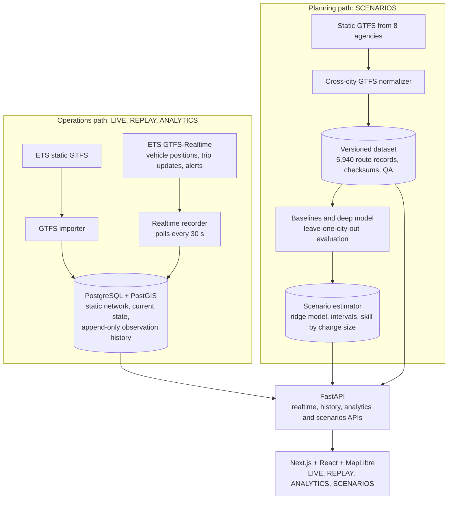

# TransitPulse architecture

Two data paths meet in one API. The **operations path** turns Edmonton's live
feeds into current state and an append-only history. The **planning path**
turns eight agencies' static timetables into a versioned dataset and a
validated estimator. The frontend reads both through the same FastAPI service.

## Components

| Component | Where | Role |
| --- | --- | --- |
| GTFS importer | `apps/api/transitpulse_api/import_gtfs.py`, `gtfs.py` | Loads the official ETS static feed into PostGIS, versioned by feed. |
| Realtime recorder | `apps/api/transitpulse_api/realtime_recorder.py`, `realtime.py` | Polls the three GTFS-Realtime feeds, updates current state and appends observations. Database triggers (migration 0007) reject updates and deletes on history tables. |
| API | `apps/api/transitpulse_api/main.py` | Network, realtime, operations, bounded history (24 h / 5,000 rows per request), analytics and scenario endpoints. |
| Cross-city normalizer | `apps/api/transitpulse_ml/gtfs_normalizer.py`, `city_registry.py` | Streams each agency's GTFS into one route-level schema (`route_schema.py`). Adding an agency is a registry entry. |
| Evaluation scripts | `scripts/evaluate_cross_city_baselines.py`, `evaluate_scenario_deltas.py`, `train_cross_city_deep_model.py` | Leave-one-city-out comparison of 7 baselines and an MLP; change skill measured by change size. |
| Scenario estimator | `apps/api/transitpulse_ml/scenario_estimator.py`, `apps/api/transitpulse_api/scenarios.py` | Anchored-difference speed estimate with intervals, out-of-range flags and confidence tied to measured skill; fleet arithmetic. |
| Frontend | `apps/web/app/` | One Next.js page with four modes over a shared MapLibre map (`mapStyle.ts`, `mapSymbols.ts`, `MapControls.tsx`) and the SCENARIOS panels (`scenarios/`). |
| Launcher | `START_TRANSITPULSE.bat` | Checks PostgreSQL/PostGIS, runs migrations, then starts or reuses the API, web app and recorder. |

## Data boundaries

- **Measured vs estimated.** Live and historical numbers come from feeds and the
  timetable. Scenario numbers are estimates and are labelled as such, with
  ranges. The current plan in SCENARIOS is read from the schedule, not modelled.
- **Artifacts are not in version control.** `artifacts/` (source archives,
  dataset, model, reports) is git-ignored and regenerated by the scripts. The API
  returns a clean 503 for SCENARIOS when the estimator artifact is missing.
- **Tests never touch the application database.** Integration tests run only
  against a database whose name ends in `_test` (see
  `apps/api/transitpulse_api/database_safety.py` and
  `scripts/setup_test_database.py`).
